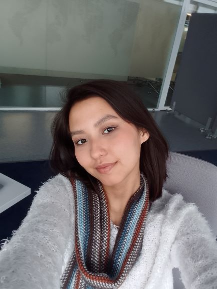
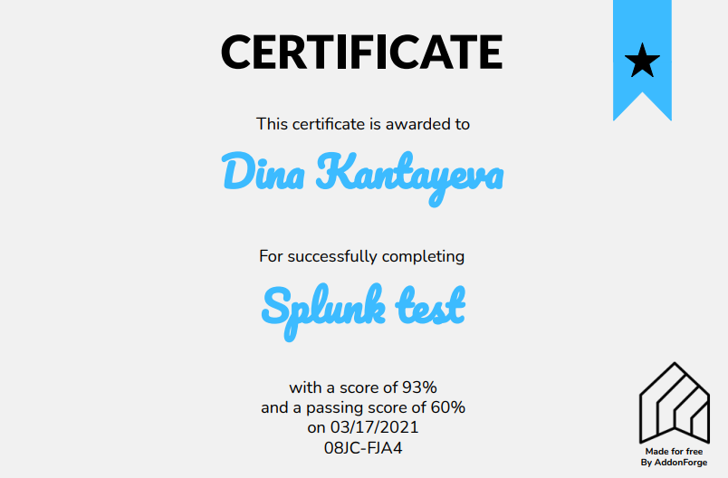

********************
# Dina Kantayeva
********************

********************
### Junior Frontend Developer
********************
### Contacts:
**Phone:** +7-708-309-08-19

**E-mail:** kantayevad@gmail.com

**Telegram:** @Riccardina

[GitHub](https://github.com/dikantayeva "GitHub")

[LinkedIn](https://www.linkedin.com/in/dikantayeva/ "LinkedIn")

**Discord nickname:** dikantayeva
********************
### Briefly About Myself:
I previously trained as a business analyst, a devops engineer, but in the end I realized that I was close to working with what I could see. Even in my first year of study at Astana IT University, I liked the discipline of web development, from where I have experience with HTML, CSS, JS, PHP. I really want to get into EPAM, as I am sure that this is the place that will give me a push in the right direction for further growth as a frontend developer.
********************
### Skills and Proficiency:
* HTML5
* CSS3
* JS
* PHP
* C++
* Git, GitHub
* VSCode
********************
### Code example:
```
const chai = require("chai");
const assert = chai.assert;

describe("Spinning words",()=>{
  it("Sample tests",()=>{
    assert.strictEqual(spinWords("Welcome"), "emocleW");
    assert.strictEqual(spinWords("Hey fellow warriors"), "Hey wollef sroirraw");
    assert.strictEqual(spinWords("This is a test"), "This is a test");
    assert.strictEqual(spinWords("This is another test"), "This is rehtona test");
    assert.strictEqual(spinWords("You are almost to the last test"), "You are tsomla to the last test");
    assert.strictEqual(spinWords("Just kidding there is still one more"), "Just gniddik ereht is llits one more");
    assert.strictEqual(spinWords("Seriously this is the last one"), "ylsuoireS this is the last one");
  });
});
```
********************
### Education & Courses:
* Astana IT University | Bachelor's Degree | Telecommunication Systems | 2019-2022
* Astana IT University | Master's Degree | Computer Science and Engineering | 2022-2024
* W3schools: HTML and CSS Tutorials;
* Huawei Seeds for the Future 2020/2021
* Splunk


********************
### Languages:
* English - B2+
* Russian - Native
* Kazakh - Intermediate
